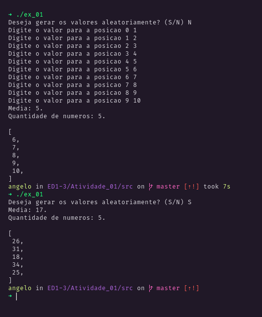
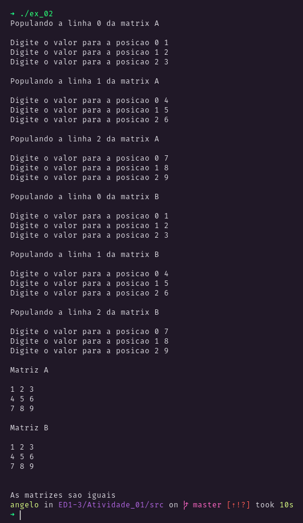

<h3 align="center">

Atividade 01

</h3>

  <a href="#exercício-01">Exercício 01</a> |
  <a href="#exercício-02">Exercício 02</a>

# Exercício 01

- Receber os valores de um vetor de números inteiros com 10 elementos;
- Informar a quantidade de elementos informados que são maiores do que a média aritmética dos valores.

**Obs.:** Codificar as funcionalidades através de funções.

## Resultado

<a target="blank" href="https://repl.it/@anevata/Exercicio-01#main.cpp">Resolução online</a>

  

&nbsp;

# Exercício 02

- Receber os valores de 2 matrizes de razão 3 x 3;
- Exibir os valores de cada uma das matrizes, observando o respectivo layout (3 x 3);
- Verificar e informar se as matrizes são iguais.

**Obs.:** Codificar as funcionalidades através de funções.

## Resultado

<a target="blank" href="https://repl.it/@anevata/Exercicio-02#main.cpp">Resolução online</a>

  

