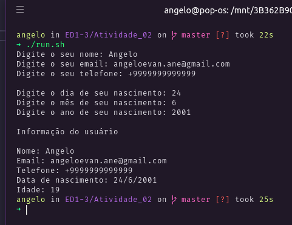

<h3 align="center">

Atividade 02

</h3>

  <a href="#Proposta">Proposta</a> |
  <a href="#Resultado">Resultado</a>

# Proposta

- Utilizar a classe Data implementada durante os exemplos da aula;

- Utilizar a data corrente (de forma fixa, exemplo: 04/09/2020 para quem estiver
escrevendo o código hoje) quando for fazer o cálculo da idade ou buscar
alternativa para pegar, de forma automática, a data do sistema operacional
(levar em conta o dia, o mês e o ano para o cálculo da idade completa).

## Resultado

<a target="blank" href="https://repl.it/@anevata/Atividade-02#main.cpp">Resolução online</a>

  

