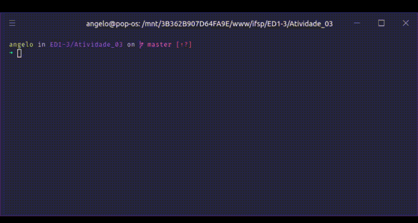

<h3 align="center">


Atividade 02

</h3>

<p align="center">
  <a href="#Proposta">Proposta</a> |
  <a href="#Resultado">Resultado</a>
</p>

# Proposta

À partir da estrutura "Funcionario" descrita abaixo:

```cpp
Funcionario {
  prontuario int;
  nome string;
  salario double;
};

```

Elabore um programa que permita administrar uma lista de funcionários e, através de um menu, ofereça as seguintes opções:

```
0.  Sair
1.  Incluir
2.  Excluir
3.  Pesquisar
4.  Listar
```

## Observações:

- Não poderão ser cadastrados funcionários com mesmo prontuário;
- A pesquisa de funcionário deverá utilizar o atributo "Prontuário" como critério e, quando encontrado, deverão ser exibidos os demais atributos;
- A listagem dos funcionários deverá apresentar todos os seus atributos e, ao final, informar o total dos salários.

## Resultado

<!-- <a target="blank" href="https://repl.it/@anevata/Atividade-02#main.cpp">Resolução online</a> -->

<p align="center">
  
</p>
