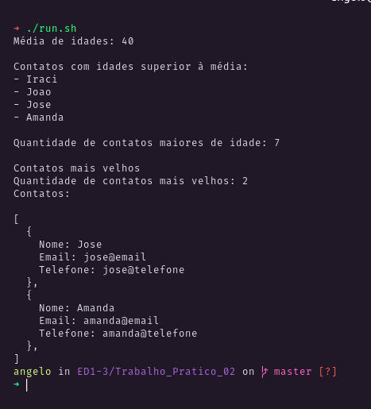

<h3 align="center">

Trabalho prático 02

</h3>

  <a href="#Proposta">Proposta</a> |
  <a href="#Resultado">Resultado</a>

# Proposta

Criar uma rotina que permita preencher os valores dos respectivos objetos e informar ao final:

- A média das idades dos contatos;
- O nome dos contatos cuja idade seja maior do que a média (geral) das idades;
- A quantidade de contatos maiores de idade; e
- O nome, o e-mail e o telefone do contato mais velho (na ocorrência de dois ou mais contatos empatarem nesse critério, mostrar todos).

## Resultado

<a target="blank" href="https://repl.it/@anevata/Trabalho-Pratico-02#main.cpp">Resolução online</a>

  

